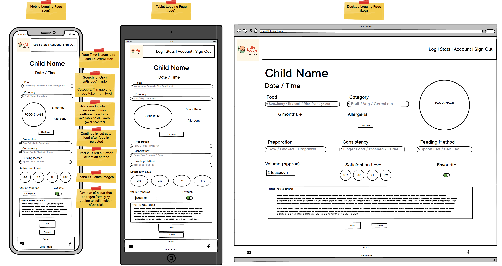
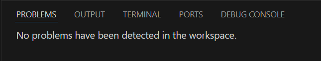
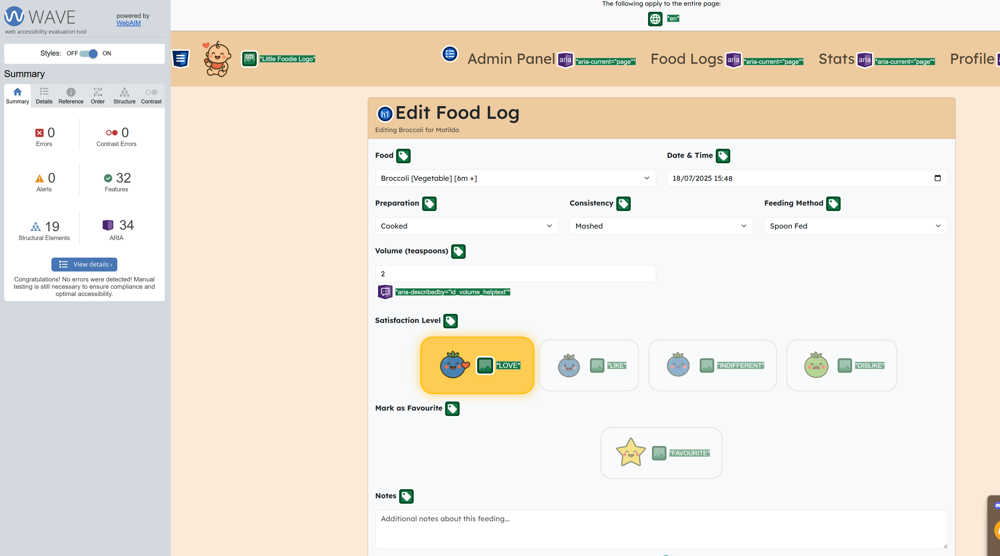
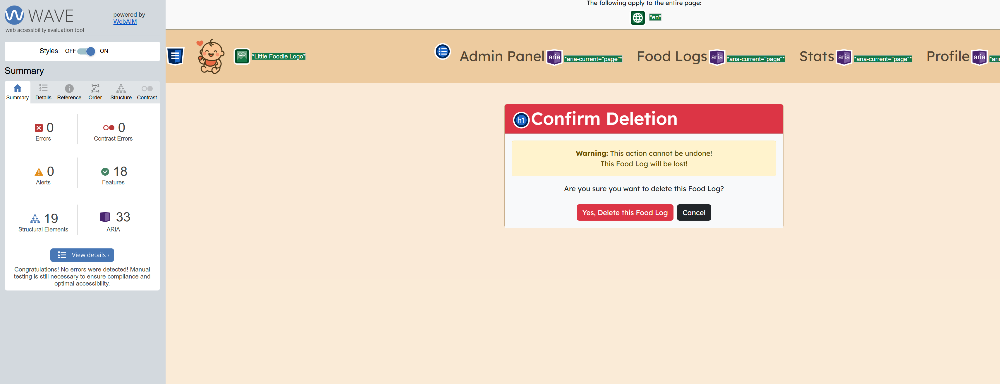
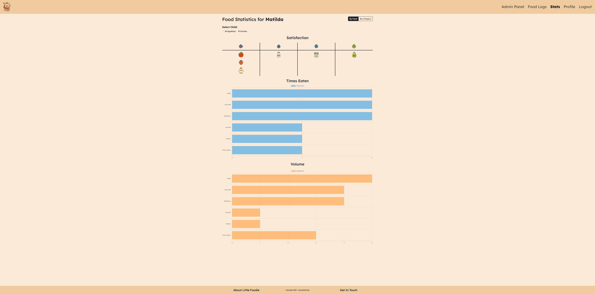

# Little Foodie - Track Tiny Tastes, One Bite at a Time

A baby weaning & tracking full stack web application - Capstone Project for Code Institute

**Author:** Paul Morgan - calculatedCode

***For Magda & Matilda***

## Description

The purpose of this full stack web application is to allow parents and caregivers to record and monitor their babies weaning journey.
As a site owner, the site is designed to be welcoming and informative with an organised layout to assist external users' usage.

This has been built using Django, Python, JavaScript, HTML, CSS, and the Bootstrap framework and Google Fonts. Excluding items listed below (AI Usage Within the Project), all code/work is my own.
Informational sources are taken from [NHS](https://www.nhs.uk/start-for-life/baby/weaning/) and the [Food Standards Agency](https://www.food.gov.uk/food-safety-and-hygiene/food-allergies-intolerances-and-coeliac-disease)

## Features

1. Homepage (Login/Register)
2. About Little Foodie
    1. How to use the app
    2. Information & Sources
    3. Disclaimer
3. Get In Touch
    1. Error Reporting
    2. Feature Request
4. Profile Section
    1. User Profile
    2. User Children
5. Food Logs section
    1. New Food Logs
    2. Historical Food Logs
6. Stats section
    1. Food Statistics
    2. Category Statistics

## Deployment Procedure

The site is deployed on [Heroku](https://www.heroku.com/) using the following steps:

1. **Set Up Heroku Account & App**
    - Create a Heroku account and a new app via the Heroku dashboard.

2. **Prepare the Project for Deployment**
    - Ensure all dependencies are listed in `requirements.txt` (use `pip freeze > requirements.txt`).
    - Add a `Procfile` with the line
    - Set `ALLOWED_HOSTS` in `settings.py` to include the Heroku app domain.
    - Configure static files using `whitenoise` or similar.

3. **Configure Environment Variables**
    - Set environment variables (e.g., `SECRET_KEY`, `DEBUG`, `DATABASE_URL`) in the Heroku dashboard under Settings > Config Vars.

4. **Set Up the Database**

5. **Push Code to Heroku**
    - Initialize a git repository if not already done.

6. **Run Migrations & Collect Static Files**

7. **Verify Deployment**
    - Visit the Heroku app URL to confirm the site is live and functioning.

**Note:** For local development, use environment variables or a `.env` file to manage sensitive settings. Always disable `DEBUG` in production.

## How to View the Project

- [View the deployed website - Little Foodie](https://little-foodie-3451586f5ac7.herokuapp.com/)

## Documents

### ERD

I designed my own ERD and then used CoPilot to verify the ERD was sufficient and that there were not any missing links or orphaned tables, I then created my ERD using [dbdiagram.io](https://dbdiagram.io/)

- **Profile**
  - `id` (PK)
  - `user` (OneToOne to User (Django))
  - `first_name`
  - `last_name`
  - `birth_date`
  - `created_at`
  - `updated_at`
- **Child**
  - `id` (PK)
  - `user` (FK to Profile)
  - `name`
  - `birthdate`
- **Food**
  - `id` (PK)
  - `name`
  - `category`
  - `min_age_months`
  - `is_allergen`
  - `image`
  - `is_authorised`
  - `created_by_user` (FK to User(Django))
- **Consistency**
  - `id` (PK)
  - `label`
- **Preparation**
  - `id` (PK)
  - `label`
- **FeedingMethod**
  - `id` (PK)
  - `label`
- **SatisfactionLevel**
  - `id` (PK)
  - `label`
- **FoodLog**
  - `id` (PK)
  - `child` (FK to Child)
  - `food` (FK to Food)
  - `consistency` (FK to Consistency)
  - `preparation` (FK to Preparation)
  - `feeding_method` (FK to FeedingMethod)
  - `satisfaction_level` (FK to SatisfactionLevel)
  - `volume`
  - `favourite`
  - `notes`
  - `logged_at`

### Wireframes / UX Design

The wireframing and initial design of the website was done with a mobile first approach, especially as parents will most likely have limited time to record the food entry so a mobile phone is the most convenient manner to access Little Foodie.

Homepage

Profile Page

Food Log Page

Stats Page

### Colours & Typography

#### Colours

When starting development I had still not decided on a colour scheme for the application, so I used `#faebd7 (AntiqueWhite)` as a placeholder colour, then as development continued I enjoyed the soft, off white contrast that this colour gave as a site-wide background, and then applied some small changes to this colour to create offsets to use for the header/footer and secondary colour schemes.

#### Typography

For typography I utilised Google Fonts, selecting "Lexend" as the font throughout the whole application as it was a clear and inviting font that I felt balanced out the presentation of informative text with readability.

### Testing & Validation

#### Unit Tests

Unit tests were created for the views and forms of the application. To reduce repetition within the test data setup of tests I created a file named utils.py, that is within testhelper folder of the root directory and then access this in all relevant unit tests using import statements. AI was also utilised to help add additional tests to the structure and exisiting unit tests I had created.

#### UI/User Story Tests

There were a total of 49 user stories sorted using MoSCoW prioritisation, 27 `Must Haves`, 6 `Should Haves` and 16 `Could Haves`.

Of these, all 27 `Must Haves` were completed creating an MVP, 4 `Should Haves` and 1 `Could Have` - with 15 `Could Haves` and 2 `Should Haves` currently in progress and in the backlog for future features

Manual UI Testing was conducted against the `Must Have` User Stories to ensure that the MVP criteria was achieved.

| User Story - MUST HAVE                                                                                                                                            | Status  |
|-------------------------------------------------------------------------------------------------------------------------------------------------------------------|---------|
| As a parent, I want to create an account and log in securely, so that I can access my data from any device.                                                       | PASSED  |
| As a parent, I want to add one or more children to my profile, so that I can track food intake for each child individually.                                       | PASSED  |
| As a parent, I want to input my baby’s birthdate, so that the app can calculate their current age in months automatically.                                        | PASSED  |
| As a parent, I want to select which child I am logging food for, so that the log is correctly attributed.                                                         | PASSED  |
| As a parent, I want to search and select from a list of foods, so that I can quickly log what my child ate.                                                       | PASSED  |
| As a parent, I want to see all foods regardless of age suitability, so that I have full control over what I log.                                                  | PASSED  |
| As a parent, I want to add custom foods to the database, so that I can log meals that aren’t already listed.                                                      | PASSED  |
| As a parent, I want to specify the consistency of the food (e.g., purée, mashed, finger food), so that I can track texture exposure.                              | PASSED  |
| As a parent, I want to indicate whether the food was raw or cooked, so that I can monitor preparation methods.                                                    | PASSED  |
| As a parent, I want to note how my baby was fed (e.g., spoon-fed or self-fed), so that I can track feeding methods.                                               | PASSED  |
| As a parent, I want to record the approximate volume of food eaten, so that I can understand their intake over time.                                              | PASSED  |
| As a parent, I want to select how much my baby liked the food (e.g., hated it, liked it), so that I can spot patterns in preferences.                             | PASSED  |
| As a parent, I want to see a history of foods my baby has eaten, so that I can revisit and compare past logs.                                                     | PASSED  |
| As a parent, I want to see which foods are eaten most frequently, so that I can spot favorites or overused options.                                               | PASSED  |
| As a parent, I want to see total volume eaten per food, so that I can monitor growth in intake.                                                                   | PASSED  |
| As a user I wish to have a profile page so that I can add children to my profile at a later date                                                                  | PASSED  |
| As a site owner, I want users to land on a home/landing page when they visit the site so that they can sign in/register                                           | PASSED  |
| As a user, I want to click a button in the footer so that I can see how the application works                                                                     | PASSED  |
| As a user, i want to be able to report an error on the site, so that it is fixed by the site owner                                                                | PASSED  |
| As a site owner, I wish to display the sources of information (NHS, FSA) to the user to forfeit any liability on information given regarding allergens and advice | PASSED  |

#### HTML Verification

HTML verification had a few semantic errors on initial testing, but these were easily rectified and mainly related to sequential headings and button elements not being able to be a descendant of an anchor element.

#### CSS warnings present upon Verification

CSS verification contained no errors, but there were warnings present. These however related to external sources (Google Fonts) and also the useage of CSS Autoprefixer which is used to allow style rule compatibility across all major browsers.

#### CSS Verification

#### Javascript Verification

JavaScript was verified using JSHint. There were four 'undefined variables': `bootstrap`, `Chart`, `foodData`, and `categoryData`. These are technically unnecessary as they are provided globally or by Bootstrap and could be removed without affecting the code's functionality. However, I chose to maintain their presence to improve code readability.

#### Javascript Manual Testing

| JavaScript File         | Function                                                           | Expected Result                                                                                                                                                        | Result   |
|-------------------------|--------------------------------------------------------------------|------------------------------------------------------------------------------------------------------------------------------------------------------------------------|----------|
| `profile.js`            | Auto dismiss alerts                                                | Alerts dismiss after 3 seconds                                                                                                                                         | PASS     |
| `error_reporting.js`    | Show/hide details and food error options based on reason selection | Show/hide details and food error options based on reason selection                                                                                                     | PASS     |
| `error_reporting.js`    | Show thank you message                                             | Show thank you message on form submit                                                                                                                                  | PASS     |
| `error_reporting.js`    | Reset form and UI state                                            | Reset form and UI state when modal is closed                                                                                                                           | PASS     |
| `food_log.js`           | Auto dismiss alerts                                                | Alerts dismiss after 3 seconds                                                                                                                                         | PASS     |
| `food_log.js`           | Attach change event to food select                                 | Fetch and display food details                                                                                                                                         | PASS     |
| `food_log.js`           | Handle satisfaction level selection                                | Update UI and hidden input                                                                                                                                             | PASS     |
| `food_log.js`           | Handle favourite toggle button                                     | Update UI and hidden input                                                                                                                                             | PASS     |
| `food_log.js`           | Attach clear form button to reset the form                         | Reset the form and UI                                                                                                                                                  | PASS     |
| `food_log.js`           | Handle new food creation via AJAX and update the food select       | Handle new food creation via AJAX and update the food select                                                                                                           | PASS     |
| `food_log.js`           | `showAlert()`                                                      | Show a Bootstrap alert message at the top of the container                                                                                                             | PASS     |
| `food_log.js`           | `showFormSections()`                                               | Show all relevant form sections when a food is selected                                                                                                                | PASS     |
| `food_log.js`           | `hideFormSections()`                                               | Hide all form sections, used when no food is selected or on form clear                                                                                                 | PASS     |
| `food_log.js`           | `handleFoodSelection()`                                            | Handle food selection changes, Fetches food details from the API and updates the UI accordingly, Shows/hides warnings and updates image, category, and favourite state | PASS     |
| `food_log.js`           | `clearForm()`                                                      | Clear the food log form and reset all UI elements to their default state                                                                                               | PASS     |
| `edit_food_log.js`      | Auto dismiss alerts                                                | Alerts dismiss after 3 seconds                                                                                                                                         | PASS     |
| `edit_food_log.js`      | Handle satisfaction level selection                                | Update UI and hidden input                                                                                                                                             | PASS     |
| `edit_food_log.js`      | Handle favourite toggle button                                     | Update UI and hidden input                                                                                                                                             | PASS     |
| `statistics.js`         | `renderCharts()`                                                   | Render bar charts for food or category statistics, Destroys previous charts before rendering new ones                                                                  | PASS     |
| `statistics.js`         | `renderSatisfactionTable()`                                        | Render the satisfaction table, showing foods by satisfaction level                                                                                                     | PASS     |
| `statistics.js`         | Toggle between Food & Category                                     | Toggle between food and category statistics                                                                                                                            | PASS     |
| `statistics.js`         | Handle child selection                                             | Handle child selection to update statistics for the selected child                                                                                                     | PASS     |

#### Python Verification

Any issues in respect of Python linting were resolved during the course of the development, utilising the `PROBLEMS` window in vsCode. I also performed a final check asking AI to review the whole solution and see if there were any issues also but returned a positive 0 response.

#### Lighthouse tests

##### Homepage

Potential savings on this page (and across the site) that would boost the Performance score mainly come from using .png extension image files, these could be improved converting to .webmp file extension formats

##### Homepage - performance potential savings

##### Food Log

Initially Accessibility scored 98 and Best Practice 96 due to unsequential headers and javascript still logging to the console.

##### Food Logs Post Fix to errors

These above errors were then rectified with brought scores back up to 100, the performance score then dropped from 99 to 82, however this is also influenced by network speed and server load, so this 'drop' in performance is not a true representation as the score can increase and decrease at different times of the day and is partially out of my control due to the external factors that affect this metric.

##### Edit Food Log

##### Statistics

##### Statistics - Performance Potential Savings

The main issue with performance on the Statistics page is down to the images in the dynamic Satisfaction table and the graphs that are rendered. I plan to look at performance saving fixes in a future release to increase this score and load timing.

#### WAVE accessibility tests

All pages were checked using WAVE for accessibility and semantic errors (such as sequential headings and contrast errors) with no errors found, a few alerts were present (skipped headings and redundant element titles) which were rectified.

One alert still remains on the Food Log page when creating a new food, the alt text of the food image is generic to all images ("Food Image") so I will be looking into generating this alternative text dynamically in a future release to statisfy this test, however the test alert is an advisement so does not impact the site or it's presentation.

See Alert below

## AI Usage Within the Project

- AI used to refine user stories into tasks and acceptance criteria.
- AI used to generate all images and logo design.
- AI used to verify ERD functionality
- AI used to generate description and meta keywords for SEO.
- AI used to refine the models post creation.
- AI used to create AJAX API function call for Food Log
- AI used to generate JS code for Graphs on statistics page
- AI used to refine unit tests
- AI used to enhance existing docstrings
- AI used to review solution for errors and also for any exposed secrets as a fall back.

### Webpage preview

#### Homepage - User Not Logged In

#### Homepage - User Logged In

#### Profile Page

#### Profile Page - Add Child

#### Food Log Page - Child Selection

#### Food Log Page - Food Log

#### Food Log Page - Add Food Log - Authorised Food

#### Food Log Page - Add Food Log - Unauthorised Food

#### Food Log Page - New Food

#### Food Log Page - Edit Food Log

#### Stats Page - Food View

#### Stats Page - Category View

#### About Modal - How To Use the App

#### About Modal - Information & Sources

#### About Modal - Disclaimer

#### Get In Touch Modal - Error Reporting

#### Get In Touch Modal - Feature Request/Contact

### Future Features

- Add a timeline filter to the statistics page.
- Adapt the statistics graphs to use visuals in place of standard bar charts utilising site imagery.
- Feeding tips based on log data for each user.
- Onboarding experience/guide on user sign up.
- Allow users to add a meal/feeding image to a log for posterity.
- Multi-user collaboration, to allow co-parents to record for their shared child and view said childs logs collectively.
- Recipe suggestions based on food selection/favourites.
- Add allergen association to a childs record (and additionally a filter to exclude foods which are related to the recorded allergen when creating a food log record).
- 3rd party/Social signup.
- Site emails the site owner/admin when a new user signs up.
- Site emails the site owner/admin when a new food is created by a user.
- Site emails the site owner/admin when a user sends an error report/feature request.
- Multi-language support (set a default language in user profile and use this a variable for all site text - German, Polish).
- Add image upload to error reporting/feature request to assist site owner better in respone to users query.

### Credits

- [Google Fonts](https://fonts.google.com/) for typography.
- [Favicon.io](https://favicon.io/) for converting logo image to favicons.
- [Pixelcut.ai](https://www.pixelcut.ai/) for removing the background from the logo and images.
- [dbdiagram.io](https://dbdiagram.io/) for the visual representation of the ERD.
- [Autoprefixer CSS Online](https://autoprefixer.github.io/) for generating stylesheet multi-browser compatibility rules.
- [JSHint](https://jshint.com/) for verifying my Javascript files.
- [WAVE](https://wave.webaim.org/) for the web accessibility evaluation tool.
- [Stack Overflow](https://stackoverflow.com/) for problem solving/syntax remembrance.
- [Microsoft Copilot](https://copilot.microsoft.com/) for image generation, code support and rubber ducking.
- [Bootstrap](https://getbootstrap.com/) for the CSS framework.
- [Django](https://www.djangoproject.com/) for the full-stack framework.
- [Am I Responsive](https://ui.dev/amiresponsive) for the multi device image on this README.
- [NHS - Start for Life](https://www.nhs.uk/start-for-life/baby/weaning/) & [Food Standards Agency](https://www.food.gov.uk/) for information and sources on allergens and recommended ages in regards to weaning.
- Alexander Tastad, Mark Briscoe & Roman Rakic from [Code Institute](https://codeinstitute.net/) for their support and guidance throughout the project.
- Magda for the idea of [Little Foodie](https://little-foodie-3451586f5ac7.herokuapp.com/), the constant support outside of code, being "market research" and letting me utilise her as a "rubber duck".
- Matilda for the inspiration of the project and the inspiration of the [Little Foodie](https://little-foodie-3451586f5ac7.herokuapp.com/) logo!
